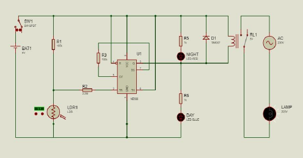
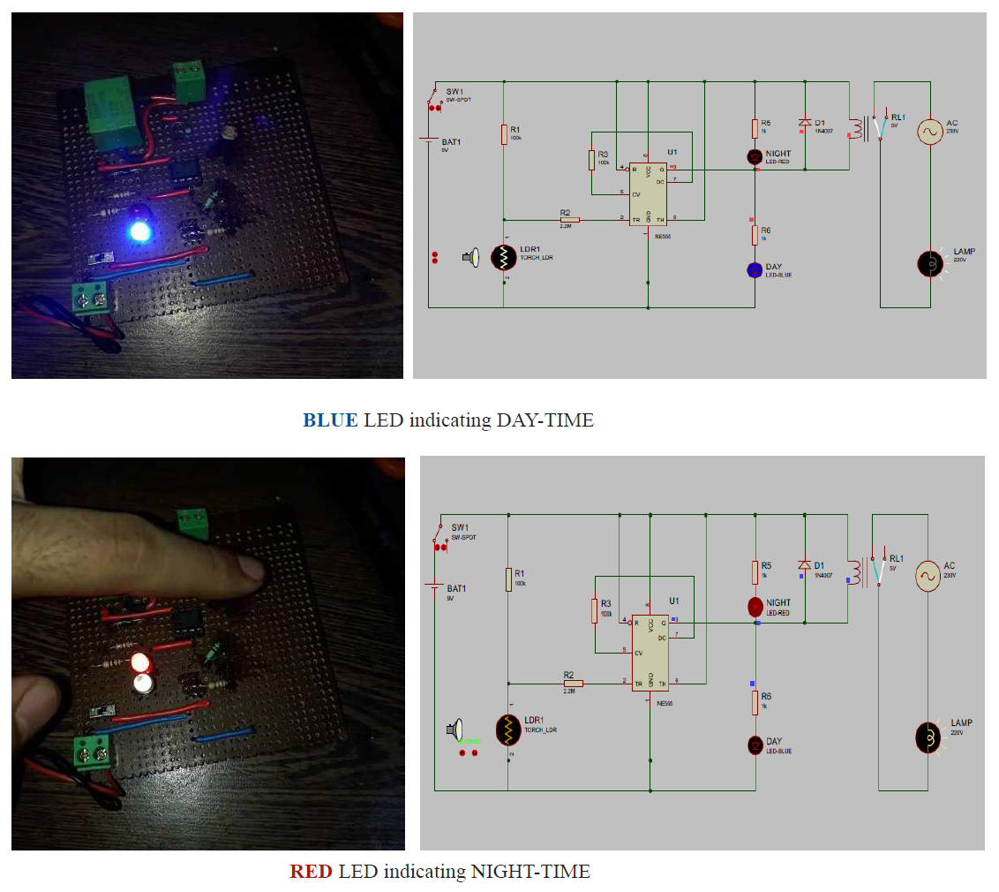

# Smart Street Light Control System using 555 Timer IC, LDR, and Relay

*This repository contains the implementation of a Smart Street Light Control System using a 555 Timer IC, Light-Dependent Resistor (LDR), and a Relay. The system uses an LDR (light dependent resistor) to detect the ambient light level and turn on the street lights when it gets dark. The 555 timer IC acts as a comparator circuit, with pin 6 connected to the positive supply voltage and pin 2 connected to the LDR. When the ambient light level falls below a certain threshold, the output of the 555 timer goes low, triggering the relay to turn on the street lights. The system can be easily used to control higher AC/DC loads by adding a relay with the LED at the output of the 555 timer.*

---

**MINI PROJECT Keynotes:**

1. This is electronic product design workshop with a **focus on electronic circuit design**.

2. The mini project may be a complete hardware or a combination of hardware and software. The **software part in mini project should be less than 50%** of the total work.

3. Mini Project should cater to a small system required in laboratory or real life.

4. It **should encompass components, devices, analog or digital ICs, micro controller** with which functional familiarity is introduced.

----

## Hardware Required

| Component | Value/Specs | Quantity |
| --------- | ----------- |:--------:|
| Timer IC  | NE555       | 1        |
| LDR       | -           | 1        |
| Diode     | 1N4007      | 2        |
| Resistor  | 1KΩ         | 2        |
| Resistor  | 100KΩ       | 2        |
| Resistor  | 2.2MΩ       | 1        |
| Relay     | 5V          | 1        |
| Battery   | 9V          | 1        |

## Circuit Diagram

## Circuit Simulation

To simulate and test the circuit, you can use **Proteus Software**, a popular electronic circuit simulation software. The circuit design for this project has been created in Proteus, and you can find the Proteus simulation file at the following location:

[Proteus Circuit Simulation File](auto_day_&_night.pdsprj)

You can open the Proteus file in Proteus software and simulate the circuit to observe its behavior under different light conditions. 

## Demonstration

## Circuit Configuration

The circuit configuration consists of an 8-pin 555 timer IC, with pins assigned specific functions. Here's a breakdown of the connections:

- Pin 5 and Pin 7: Connected by a 100k resistor, which pulls Pin 5 to ground. Pin 7 is connected to the collector of a PNP transistor inside the 555 timer, which is also connected to ground. This setup provides a reference voltage for the 555 timer's Comparator 1.
- Pins 8 and 6: Connected to the power supply (Vcc), ensuring stable voltage levels for proper operation.
- Pin 4: Connected to the ground, which is Reset low.
- Pin 1: Connected to the ground,establishing the common ground reference for the circuit.
- Pin 2: To detect the intensity of ambient light, a Light-Dependent Resistor (LDR) is used. The LDR is connected in series with a 100k resistor, forming a voltage divider circuit. This voltage divider circuit is connected to pin 2 (trigger input) of the 555 timer IC via a 2.2 M ohm resistor.
- Pin 3: Output of the circuit. High during Day, Low during Nighttime.

## Functionality

The Smart Street Light Control System operates as follows:

1. During nighttime:
   
   - When the ambient light level falls below a certain threshold, the resistance of the LDR increases.
   - This causes an increase in the voltage at the junction of the LDR and the 100k resistor, triggering the 555 timer IC.
   - The 555 timer IC turns pin 3 (output pin) low, which is connected to the cathode of the red LED. The anode of the red LED is connected to Vcc.
   - The red LED illuminates and activates the relay, providing the required lighting for the street lights during nighttime. The relay also includes a 1n4007 flyback diode for surge protection.

2. During daylight hours:
   
   - When the ambient light intensity increases, the resistance of the LDR decreases.
   - This reduces the voltage at the junction of the LDR and the 100k resistor, deactivating the 555 timer IC.
   - The output pin 3 of the 555 timer IC turns high, indicating that the street lights are off.
   - A blue LED, with its anode connected to pin 3 and cathode to ground, is activated, indicating the state of the street lights.

Please refer to the circuit diagram and demonstration image provided in this repository for a visual representation of the setup.

## Project Group Members

1. [Ankit](https://github.com/ankitsamaddar)
2. [Meheli](https://github.com/MeheliR)
3. [Souvik](https://github.com/iamsouvik9)
4. [Arnab](https://github.com/Arnab-png)

## License

This project is licensed under the [MIT License](LICENSE). 
